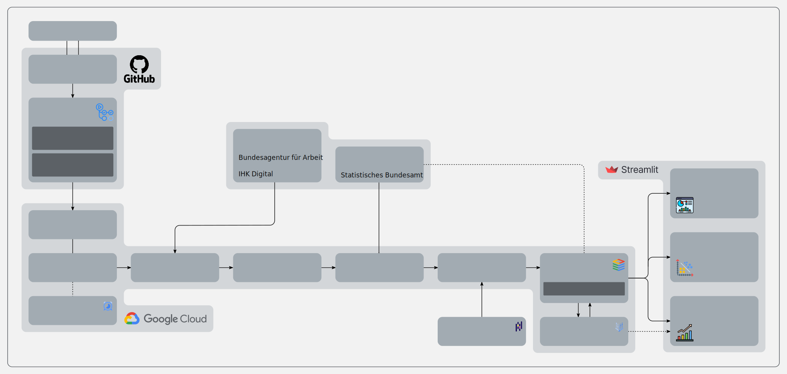

# AusbildungMining

AusbildungMining is a datamining project about vocational trainings in Germany.

For this purpose a GitHub repo is setup to be connected with a Google Cloud project. Data mining and analysis shall happen as serverless cloud functions, while the mined results shall be stored on an SQL database. Check the [devdiary](devdiary.md) and changelog to see the latest updates.

This is a purely personal project to practice data science.